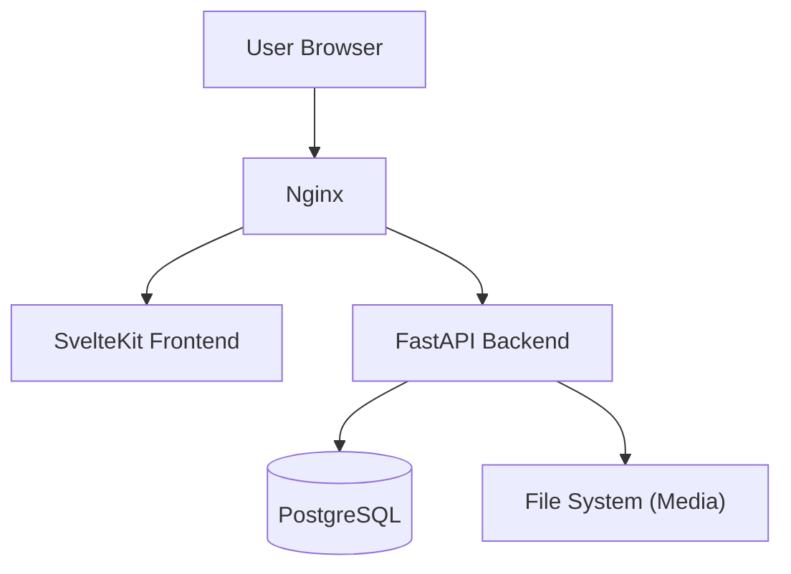

# 📚 Audiobook Web App

An immersive web-based audiobook reader featuring real-time text-audio alignment. Designed to bridge the gap between AI communication and human learning, it turns AI-generated Markdown content into spoken audio, helping you absorb knowledge and improve capabilities through listening.

一款具备实时文本对齐功能的沉浸式有声书 Web 应用。旨在连接 AI 交流与人类学习，它专门用于朗读 AI 生成的 Markdown 资料，将枯燥的文字教程转化为生动的听读体验，辅助你深度消化知识、提升能力。

---

## ✨ Introduction / 简介

**Audiobook Web App** is a modern solution for audiobook enthusiasts who want to host their own library. It provides a seamless experience for uploading, managing, and listening to audiobooks directly in your browser.

**Audiobook Web App** 是为希望托管自己书库的有声书爱好者提供的现代解决方案。它提供了直接在浏览器中上传、管理和收听有声书的无缝体验。

Unlike standard players, this application specializes in **synchronized reading**: it pairs audio with text, allowing you to read along as you listen, complete with word-level highlighting. It is perfect for language learners or anyone who enjoys an immersive reading experience.

与标准播放器不同，本应用专注于**同步阅读**：它将音频与文本配对，允许你在收听时跟读，并配备单词级高亮显示。它非常适合语言学习者或任何享受沉浸式阅读体验的人。

### 🚀 Key Features / 主要功能

- **Self-Hosted & Private**: You own your data. No third-party tracking.
  - **自托管与隐私优先**：你拥有自己的数据。无第三方追踪。
- **Web-Based Player**: Access your library from any device with a modern browser.
  - **基于 Web 的播放器**：通过任何带有现代浏览器的设备访问你的书库。
- **Synchronized Playback**:
  - **同步播放**：
  - **Text-to-Speech Generation**: Upload a `.txt` file, and the server will generate audio and word-level alignment data automatically (using Edge-TTS).
    - **TTS 语音生成**：上传 `.txt` 文件，服务器将自动生成语音和单词级对齐数据（使用 Edge-TTS）。
  - **Custom Audiobooks**: Upload your own pre-generated aligned audiobooks (via ZIP).
    - **自定义有声书**：上传你自己预先生成的对齐有声书（通过 ZIP）。
- **Progress Tracking**: Automatically remembers your playback position for every book.
  - **进度追踪**：自动记住每本书的播放位置。
- **User Management**: Multi-user support with an invitation code system to control registration.
  - **用户管理**：支持多用户，配备邀请码系统以控制注册。
- **Advanced Library Management**:
  - **Tagging System**: Organize books with custom user-scoped tags.
  - **Flexible Sorting**: Sort your library by title, creation date, or book duration.
  - **Tag Filtering**: Quickly find books using the sidebar filtering system.
  - **Sequential Playback (PlayAll)**: Play all visible books in the current filtered/sorted list sequentially with automatic transitions.
- **高级书架管理**:
  - **标签系统**: 使用自定义用户级标签组织书籍。
  - **灵活排序**: 按标题、创建日期或书籍时长对书库进行排序。
  - **标签过滤**: 使用侧边栏过滤系统快速查找书籍。
  - **列表播放 (PlayAll)**: 按顺序连续播放当前过滤/排序列表中的所有书籍，支持自动切换。
- **Responsive Design**: Built with SvelteKit for a fast, fluid UI on desktop and mobile.
  - **响应式设计**：基于 SvelteKit 构建，在桌面和移动端提供快速、流畅的用户界面。

---

## 🔒 Privacy & Security / 隐私与安全

- **No IP Logging**: This software is designed **not** to record or store user IP addresses.
  - **无 IP 记录**：本软件设计为**不**记录或存储用户 IP 地址。
- **Minimal Data Collection**: The activity log only tracks essential actions (e.g., "User X uploaded Book Y") to help administrators clean datas, without compromising user anonymity regarding their location or device fingerprint.
  - **最小化数据收集**：活动日志仅跟踪必要的操作（例如，“用户 X 上传了书籍 Y”），以帮助管理员清理数据，而不会泄露用户关于位置或设备指纹的匿名性。
- **Self-Contained**: No external analytics or "phone home" telemetry.
  - **完全独立**：无外部分析或“回传”遥测。

---

## 📂 Supported Formats / 支持的格式

### ✅ Fully Supported / 完全支持

- **Plain Text (`.txt`)**:
  - **纯文本 (`.txt`)**：
  - Upload a text file, and the system automatically converts it to an audiobook using high-quality TTS.
    - 上传文本文件，系统将使用高质量 TTS 自动将其转换为有声书。
  - Generates word-level timestamps for synchronized highlighting.
    - 生成用于同步高亮的单词级时间戳。
- **Audiobook Packages (`.zip`)**:
  - **有声书包 (`.zip`)**：
  - For advanced users who want to upload pre-processed books.
    - 适用于想要上传预处理书籍的高级用户。
  - **Structure**: The ZIP must contain chapter files matching the naming convention: `ch001_audio.mp3`, `ch001_text.txt`, `ch001_align.json`.
    - **结构**：ZIP 必须包含符合命名约定的章节文件：`ch001_audio.mp3`, `ch001_text.txt`, `ch001_align.json`。

### ⚠️ Experimental / Not Currently Supported / 实验性/暂不支持

- **EPUB (`.epub`)**:
  - Support for standard EPUB files is currently **experimental** and **incomplete**.
    - 对标准 EPUB 文件的支持目前是**实验性的**且**不完整**。
  - You may experience issues with chapter parsing or text display.
    - 你可能会遇到章节解析或文本显示的问题。

---

## 🛠 Architecture / 架构

The project is built on a robust, containerized microservices architecture:
本项目构建在稳健的容器化微服务架构之上：

- **Frontend**: SvelteKit (Node.js) - Provides a fast, reactive user interface.
  - **前端**：SvelteKit (Node.js) - 提供快速、响应式的用户界面。
- **Backend**: FastAPI (Python) - Handles business logic, file processing, and TTS generation.
  - **后端**：FastAPI (Python) - 处理业务逻辑、文件处理和 TTS 生成。
- **Database**: PostgreSQL - Stores user data, book metadata, and reading progress.
  - **数据库**：PostgreSQL - 存储用户数据、书籍元数据和阅读进度。
- **Gateway**: Nginx - Acts as a reverse proxy to handle routing and static files.
  - **网关**：Nginx - 作为反向代理处理路由和静态文件。
- **Infrastructure**: Docker Compose - Orchestrates all services for easy deployment.
  - **基础设施**：Docker Compose - 编排所有服务以便轻松部署。



---

## 🚀 Deployment / 部署

For detailed status on deploying to a cloud server with Nginx and SSL, please refer to the [Cloud Deployment Guide](docs/CLOUD_DEPLOYMENT.md).
有关使用 Nginx 和 SSL 部署到云服务器的详细状态，请参阅 [云部署指南](docs/CLOUD_DEPLOYMENT.md)。

### Quick Start (Local) / 快速开始（本地）

1.  **Clone the repository / 克隆仓库**:

    ```bash
    git clone https://github.com/yourusername/Audiobook_web_APP.git
    cd Audiobook_web_APP
    ```

2.  **Configure Environment / 配置环境**:

    ```bash
    cp .env.example .env
    # Edit .env and set your secrets and database credentials
    # 编辑 .env 并设置你的密钥和数据库凭据
    ```

3.  **Start with Docker Compose / 使用 Docker Compose 启动**:

    ```bash
    docker compose up -d --build
    docker compose up -d --build frontend backend
    ```

4.  **Access the App / 访问应用**:
    Open `http://localhost:8123` (or your configured port).
    打开 `http://localhost:8123`（或你配置的端口）。

---

## 🤝 Contributing / 贡献

Contributions are welcome! If you're interested in improving EPUB support or adding new features, please submit a Pull Request.
欢迎贡献！如果你有兴趣改进 EPUB 支持或添加新功能，请提交 Pull Request。

## 📄 License / 许可证

[MIT License](LICENSE)
